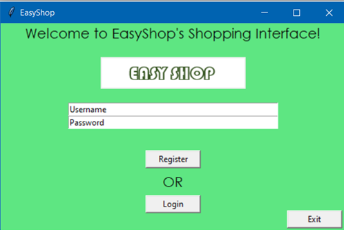

# EasyShop-User-Interface
Welcome to the EasyShop User Interface! This program fetches images from urls as per choices of clothes made by you and displays them in a Tk() window!
Made by Adit Sinha, Ekhnoor Grover and Ahaan Bohra

## Project Overview
EasyShop User Interface is a shopping program we created for people who want to buy specific cloth wear.
They start by logging into the interface, if it is their first time using it then they must register.
We provide certain choices through which they can get to what they want faster.
Using the ‘Tkinter’ module and ‘PIL’ module we managed to display images of the clothing options for the user.
They can choose the clothes they would like to add to the cart and finally checkout.
We hope to work more and improve upon this shopping interface.

## Acknowledgments
We would like to express our special thanks of gratitude to our computer science teacher, Paulina Singh ma’am who helped us develop and expand this project (EasyShop Login Interface) through her suggestions and teachings. She constantly advised us and assisted wherever we needed help, allowing us to produce this project.

Secondly, we would also like to thank our senior Arjun Sodhi [12-D] who helped us understand some concepts of Tkinter and fixes a minor error in the code.


## Python Concepts Used
1. Lists:
2. User Defined Functions:
3. Dictionaries: 
4. File Handling:
5. Importing a function from a file:
6. In built functions:
7. ‘Tkinter’ module:
8. ‘PIL’ module:
9. ‘urllib’ module:
We have used many different python concepts in our project, some of which had been taught to us in class and some others which we had to find out and research by ourselves:
•	We used lists numerous times to store data as it is a very useful and popular data structure to hold organised data
•	 We used many user defined functions with appropriate names so the Code is readable by anyone and it is well organised
•	We also made use of file handling which is primarily next year's course, however we used it here so that we can combine the different aspects of the project into one. 
•	The ‘Tkinter’ module is one thing which will not be taught to us in school. It is a module to make a relatively simple general user interface, and we applied it to every part of our project.
•	We also experimented with the PIL and urllib module in python in order to get the image from the link and portray it in the Tk window.


## Requirements
1. Must have pip installed
2. Must download the ‘PIL’ module by entering the following in shell:

   ```python
   $pip install pillow
   ```
3. Must have the data files(‘MenTopwear.txt', ‘MenBottomwear.txt’, ‘MenFootwear.txt’, ‘WomenTopwear.txt', ‘WomenBottomwear.txt’, ‘WomenFootwear.txt’, ‘KidsTopwear.txt’, ‘KidsBottomwear.txt’ and ‘KidsFootwear.txt'), in their system.
4. Must also have the images used in program on their system (eg. the easy shop logo)
5. All files(python and data) and images must be in the same directory(folder)


## Output Screens
Screen 1: First Screen, allows user to register a new user or go to Login page

Screen 2: Screen if user enters a username already present
 


Screen 3: Login Page; user logs into their EasyShop account
 
Screen 4: Screen if user’s login credentials are incorrect
 


Screen 5: Home Page, allows user to contact support, continue shopping or proceed to cart
 
Screen 6: Screen if user tries to proceed to cart without buying any items
 


Screen 7: Contact Page (accessed if ‘Contact Support’ button pressed
 
> Pressing ‘Back’ button takes them to screen 5
Screen 8 and 9: Screen to make choices for shopping
 

 


Screen 10: Screen if continue pressed without making all 3 choices
 


Screen 11: Shopping Page 
 


Screen 12 and 13: Shopping Page screen if list of clothes available finished
 
 
Screen 14: Shopping Page if item added to cart (thrice)
 
	When ‘Return to home’ button is pressed, goes back to Screen 5
	When ‘Proceed to Cart’ button is pressed, goes to Screen 15


Screen 15: Checkout Page 
 
	Pressing ‘Shop More’ goes to screen 5
	Pressing ‘Proceed to pay’ goes to screen 17


Screen 16: Checkout Page after a user buys another item after making choice
 


Screen 17: Final Screen; Thank you Page
 

	


## Limitations and Future Scope
We are planning to add many new features as we progress with our project. The limitations and future scope of our application are huge. 
•	Instead of manually and laboriously copying and pasting URLs into our files to use them, we are planning to use web scraping which will automatically do it for us. This will increase the amount of clothes at our “shop” and make it much easier for us. 
•	We are also planning on adding a delete to items in the cart so that the person can go back on his choice if, by mistake, he has chosen the wrong one. 
•	Another idea that we are planning to implement is a price estimate. Currently in our project we have rigid price ranges which do not have a lot of variability, however we are planning to implement an input to take the price and offer clothes around that price range to the user.

## Bibliography 
1. https://www.geeksforgeeks.org/python-gui-tkinter/
2. https://www.w3schools.in/python-tutorial/gui-programming/
3. https://smallbusiness.chron.com/
4. https://linuxhint.com/
5. https://docs.python.org/3/library/urllib.html
6. https://www.geeksforgeeks.org/python-urllib-module/
